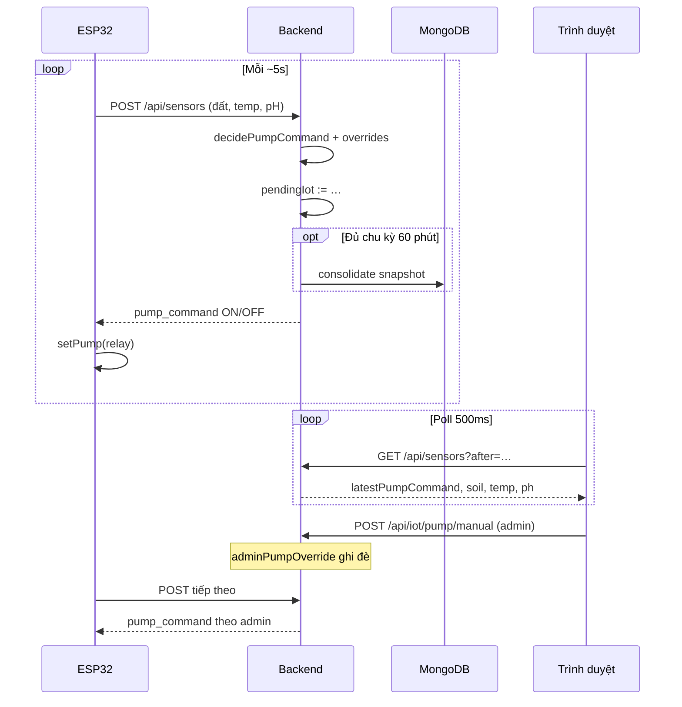

# VisionComputer — Luồng cảm biến (Sensor)

Tài liệu này mô tả **chỉ luồng dữ liệu cảm biến và điều khiển máy bơm** (ESP32 ↔ Backend ↔ Giao diện), phục vụ viết báo cáo. Không mô tả AI vision, blockchain hay demo video.

---

## Mục lục

1. [Tổng quan](#tổng-quan)
2. [Phần cứng ESP32](#phần-cứng-esp32)
3. [Chu kỳ đo và gửi dữ liệu](#chu-kỳ-đo-và-gửi-dữ-liệu)
4. [Backend nhận telemetry](#backend-nhận-telemetry)
5. [Logic quyết định bơm](#logic-quyết-định-bơm)
6. [Ghi đè thủ công (giọng nói / admin UI)](#ghi-đè-thủ-công-giọng-nói--admin-ui)
7. [Frontend đọc trạng thái](#frontend-đọc-trạng-thái)
8. [Sơ đồ luồng](#sơ-đồ-luồng)
9. [API liên quan cảm biến](#api-liên-quan-cảm-biến)

---

## Tổng quan

```text
┌──────────────┐     POST telemetry      ┌─────────────────────┐
│  ESP32       │ ───────────────────────►│  Express Backend    │
│  Đất, pH,    │ ◄───────────────────────│  home.controller    │
│  Rơ-le bơm   │     pump_command        │  + pump.helper      │
└──────────────┘                         └──────────┬──────────┘
                                                    │
                                                    ▼
                                         ┌─────────────────────┐
                                         │  MongoDB            │
                                         │  (snapshot định kỳ) │
                                         └─────────────────────┘
                                                    ▲
┌──────────────┐     GET ?after=…                   │
│  Trình duyệt │ ────────────────────────────────────┘
│  Chart + IoT │
└──────────────┘
```

| Thành phần | Vai trò trong luồng sensor |
|------------|---------------------------|
| **ESP32** (`web/arduino.cpp`) | Đọc ADC độ ẩm đất, pH; gửi JSON lên server; bật/tắt rơ-le theo `pump_command`. |
| **POST `/home/api/sensors`** | Nhận telemetry ESP32; tính lệnh bơm; trả JSON cho firmware. |
| **GET `/home/api/sensors?after=…`** | Frontend (và ESP32 fail-safe) lấy snapshot mới nhất: đất, nhiệt độ, pH, trạng thái bơm. |
| **RAM `pendingIot`** | Bản sao IoT mới nhất trên server (trước khi ghi DB theo chu kỳ). |

---

## Phần cứng ESP32

| Chân / thiết bị | Chức năng |
|-----------------|-----------|
| GPIO32 (ADC) | Cảm biến độ ẩm đất |
| GPIO33 (ADC) | Mạch đo pH |
| GPIO4 | Rơ-le máy bơm (**Active LOW**: `LOW` = bật bơm) |
| Nhiệt độ | Gửi hằng `REPORT_TEMP_C` trong JSON (không bắt buộc DHT trên board) |

Hiệu chuẩn đất: hai điểm `SOIL_RAW_AT_DRY` / `SOIL_RAW_AT_WET` → map ra **0–100%** (0% = khô, 100% = ướt). Firmware lấy **trung vị 9 mẫu** ADC để giảm nhiễu.

---

## Chu kỳ đo và gửi dữ liệu

Trong `loop()` của ESP32, mỗi **~5 giây** (`SAMPLE_INTERVAL_MS`):

1. Đọc `%` độ ẩm đất (và pH nếu có).
2. **POST** lên server:

   ```http
   POST http://<SERVER_HOST>/home/api/sensors
   Content-Type: application/json

   {
     "tree_id": "TREE_001",
     "soil_moisture": 42,
     "temperature": 28.0,
     "ph": 6.5
   }
   ```

3. Parse response JSON, lấy `pump_command` (`"ON"` | `"OFF"`).
4. Gọi `setPump(on)` điều khiển rơ-le.

**Fail-safe khi mất server:** nếu POST/GET thất bại và đất &lt; `LOCAL_DRY_PERCENT` (mặc định 20%), ESP32 có thể **bật bơm local**; nếu đất đủ ướt (`SOIL_LOCAL_FORCE_PUMP_OFF_FROM`) thì **ép tắt** rơ-le dù server không phản hồi.

---

## Backend nhận telemetry

Handler: `postSensorData` trong `web/controllers/home.controller.ts`.

1. **Validate** body qua `parseEsp32SensorsPostBody` — chỉ chấp nhận `tree_id`, `soil_moisture`, `temperature`, `ph` (không nhận `ai_vision_data` từ ESP32).
2. **Tính bơm tự động** từ độ ẩm: `decidePumpCommand(soilMoisture, pumpStatusHiệnTại)` — hysteresis **bật &lt; 25%**, **tắt ≥ 60%** khi đang bơm.
3. (Khi đang chạy demo video) có thể áp thêm `pumpCommandForEsp32WithDemoPolicy` — không thuộc luồng sensor thuần; báo cáo sensor có thể bỏ qua.
4. **Áp ghi đè thủ công** (admin ưu tiên cao hơn giọng nói) — xem mục dưới.
5. Cập nhật **`pendingIot`** trong RAM (đất, nhiệt độ, pH, `pumpStatus`).
6. Ghi MongoDB **theo chu kỳ** (`LIVE_DB_INTERVAL_MINUTES`, mặc định 60 phút) qua `consolidateAndSaveIfDue`.
7. Trả response cho ESP32:

   ```json
   {
     "success": true,
     "pump_command": "ON",
     "pump_reason": "soil_dry<25%",
     "health_status": "Healthy",
     "health_percent": 92.5,
     "threshold_min_moisture": 25
   }
   ```

`health_*` trong response phục vụ **hiển thị / tham khảo**; quyết định bơm chính từ đất và ghi đè thủ công.

---

## Logic quyết định bơm (tự động — tầng thấp nhất)

File: `web/helpers/pump.helper.ts` — **hysteresis 25% / 60%**

| Trạng thái bơm hiện tại | Độ ẩm đất | Lệnh | Ý nghĩa |
|------------------------|-----------|------|---------|
| TẮT | &lt; 25% | **ON** | Đất khô → bật bơm |
| TẮT | 25% – 59% | **OFF** | Vùng trung gian, chưa cần bơm |
| TẮT | ≥ 60% | **OFF** | Đất đủ ẩm |
| **BẬT** | &lt; 60% | **ON** | Tiếp tục tưới cho đến 60% |
| **BẬT** | ≥ 60% | **OFF** | Đạt ngưỡng ướt → tắt bơm |

**Quan trọng:** Bơm **không** tắt ngay khi vượt 25%. Chỉ tắt ở **≥ 60%** nếu đang bơm; nếu đang tắt và đất 25–59% thì giữ tắt.

Thứ tự ưu tiên ghi đè:

| Bước | Nguồn | Ghi chú |
|------|-------|---------|
| 1 | `adminPumpOverride` | **Cao nhất** — nút Admin UI |
| 2 | `voicePumpOverride` | Giọng nói |
| 3 | `decidePumpCommand` | Tự động 25% → 60% |

ESP32 chỉ thấy trường `pump_command` cuối cùng sau khi server áp dụng toàn bộ chuỗi trên.

---

## Ghi đè thủ công (giọng nói / admin UI)

| Kênh | API | Quyền | Ghi chú |
|------|-----|--------|---------|
| Giọng nói | `POST /home/api/iot/pump` (`source: "voice"`) | Ghi đè tự động đến khi bấm **Tự động bơm** | Wit.ai / parser local |
| **Admin UI** | `POST /home/api/iot/pump/manual` + header `X-Pump-Admin-Key` | **Cao nhất** | Khóa mặc định `vision-admin` (đổi bằng `PUMP_ADMIN_KEY` trong `.env`) |
| Trả về tự động | `DELETE /home/api/iot/pump-override` | Xóa mọi ghi đè | Bơm lại theo `decidePumpCommand` |

Trên giao diện: panel **Điều khiển Admin — Máy bơm** (viền vàng, badge *Quyền cao nhất*) với **Bật bơm** / **Tắt bơm** / **Tự động (25% → 60%)**.

Cấu hình server (`web/.env`, tùy chọn):

```env
PUMP_ADMIN_KEY=your-secret-key-here
```

Không khai báo thì dùng khóa mặc định `vision-admin`.

---

## Frontend đọc trạng thái

- Polling **500 ms** (khi stream đang chạy): `GET /home/api/sensors?after=<ISO timestamp>`.
- Response dùng cho tile IoT:
  - `latestSoilMoisture`, `latestTemperature`, `latestPh`
  - `latestPumpCommand`, `pumpSource` (`ram` | `db_wide` | `voice_override` | `admin_override` | …)
- UI cập nhật `#iotPumpValue`, `#heroSoilMoisture`, dòng `#latestStatusLine`.

---

## Sơ đồ luồng



---

## API liên quan cảm biến

| Method | Đường dẫn | Mô tả |
|--------|-----------|--------|
| `POST` | `/home/api/sensors` | ESP32 gửi telemetry; nhận `pump_command`. |
| `GET` | `/home/api/sensors?after=` | Poll bản ghi / snapshot IoT + AI cho chart. |
| `POST` | `/home/api/iot/pump` | Ghi đè bơm qua giọng nói (`source: "voice"`). |
| `POST` | `/home/api/iot/pump/manual` | Ghi đè bơm admin (`source: "admin"` + khóa). |
| `DELETE` | `/home/api/iot/pump-override` | Trả bơm về chế độ tự động (đất). |

Route mount tại `/` và `/home` (`web/routes/index.routes.ts`).

---

*Tài liệu sensor: cập nhật khi đổi ngưỡng `ESP32_DRY_THRESHOLD_PERCENT`, interval ESP32, hoặc contract JSON trong `arduino.cpp` / `home.validate.ts`.*
