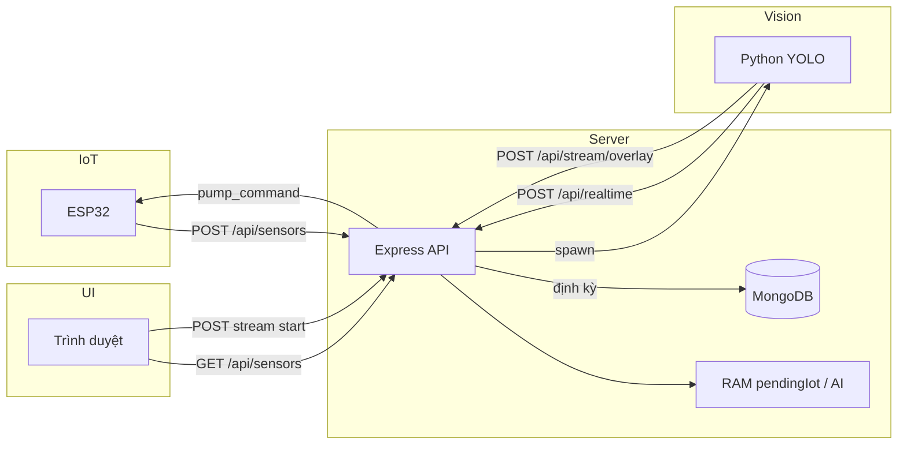
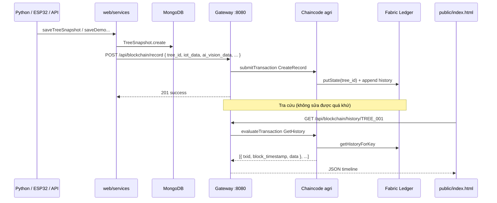

# VisionComputer

**Hệ thống giám sát cây trồng thông minh** kết hợp **cảm biến IoT (ESP32)**, **AI vision (YOLO)**, **backend Node.js + MongoDB**, và **sổ cái phân tán Hyperledger Fabric** để lưu vết dữ liệu **bất biến**, phục vụ báo cáo / poster / demo.

> **Gợi ý poster:** Chèn ảnh chụp màn hình vào thư mục [`docs/poster/`](docs/poster/). README dùng đường dẫn tương đối — thay file PNG/JPG cùng tên là hiển thị được trên GitHub hoặc khi xuất PDF.

---

## Mục lục

1. [Tổng quan hệ thống](#tổng-quan-hệ-thống)
2. [Phần 1 — IoT, AI Vision & Web](#phần-1--iot-ai-vision--web)
3. [Phần 2 — Blockchain (Hyperledger Fabric)](#phần-2--blockchain-hyperledger-fabric)
4. [Tính bất biến & demo toàn vẹn dữ liệu](#tính-bất-biến--demo-toàn-vẹn-dữ-liệu)
5. [Cấu trúc thư mục](#cấu-trúc-thư-mục)
6. [Chạy nhanh (local)](#chạy-nhanh-local)
7. [Ảnh demo cho poster](#ảnh-demo-cho-poster)

---

## Tổng quan hệ thống

VisionComputer theo dõi **một cây (tree_id)** qua hai luồng song song:

| Luồng | Mục đích | Lưu trữ chính |
|-------|----------|----------------|
| **Vận hành realtime** | Đo đất, bơm, AI camera, biểu đồ | MongoDB + RAM |
| **Chứng minh / audit** | Không sửa được quá khứ trên chuỗi | Hyperledger Ledger |

```text
                    ┌─────────────────────────────────────────────────────────┐
                    │                    PHẦN 1 — VẬN HÀNH                   │
                    └─────────────────────────────────────────────────────────┘

   ESP32                    Express (web/)                 Python (cv.engine/)
  đất·pH·bơm  ──POST──►  controllers + MongoDB  ◄──spawn──  YOLO + OpenCV
       ▲                         │  │
       │                         │  └──► Telegram (tùy chọn)
       └── pump_command          │
                                 ▼
                          Trình duyệt (Pug + Chart.js)
                          Demo / Live · Admin bơm · Giọng nói

                    ┌─────────────────────────────────────────────────────────┐
                    │              PHẦN 2 — BLOCKCHAIN (AUDIT)               │
                    └─────────────────────────────────────────────────────────┘

   MongoDB (có thể sửa)  ──POST snapshot──►  Gateway :8080  ──gRPC──►  Fabric Peer
                                                      │                      │
                                                      │                      ▼
                                              UI kiểm tra (public/)    Chaincode `agri`
                                              lịch sử · hash · cảnh báo   Ledger bất biến
```


*Hình 1 — Đặt file `docs/poster/01-kien-truc-tong-the.png` (sơ đồ hoặc collage kiến trúc).*

---

## Phần 1 — IoT, AI Vision & Web

### 1.1 Thành phần

| Thành phần | Đường dẫn | Vai trò |
|------------|-----------|---------|
| **ESP32** | `web/arduino.cpp` | Độ ẩm đất, pH, rơ-le bơm; POST telemetry ~5s |
| **Backend** | `web/` | API, logic bơm (25%→60%), spawn Python |
| **AI Engine** | `visioncomputer/video_tracking_stream.py` | YOLO segment lá → % sức khỏe |
| **Frontend** | `web/views/`, `web/public/javascript/script.js` | Video overlay, chart, admin bơm |

### 1.2 Sơ đồ luồng (Phần 1)



**Bơm tự động (hysteresis):** bật khi đất **< 25%**; khi đang bơm chỉ tắt khi **≥ 60%**. Admin UI và giọng nói ghi đè lên logic này.

### 1.3 Ảnh minh họa Phần 1

| # | File gợi ý | Nội dung chụp |
|---|-------------|----------------|
| 2 | `docs/poster/02-giao-dien-dashboard.png` | Trang chủ: video YOLO, biểu đồ, ô đất/bơm/AI |
| 3 | `docs/poster/03-esp32-cam-bien.png` | Board ESP32 + cảm biến đất / mạch pH |
| 4 | `docs/poster/04-yolo-tracking.png` | Khung overlay lá (demo hoặc live) |


---

## Phần 2 — Blockchain (Hyperledger Fabric)

Thư mục gốc: **`blockchain/blockchain-leaf/`**

```text
blockchain/blockchain-leaf/
├── chaincode/                    # Smart contract (TypeScript → deploy lên Fabric)
│   └── index.ts                  # CreateRecord, GetHistory
├── application.gateway/          # Cầu nối HTTP ↔ Fabric (port 8080)
│   ├── app.ts                    # Express + Fabric Gateway SDK
│   └── public/                   # UI kiểm tra toàn vẹn & lịch sử
│       ├── index.html
│       ├── scripts.js
│       └── style.css
└── test-network/                 # (sau khi khởi tạo) crypto, peer, orderer
```

### 2.1 Vai trò từng lớp

| Lớp | File | Chức năng |
|-----|------|-----------|
| **Chaincode** | `chaincode/index.ts` | `CreateRecord(id, json)` ghi World State; `GetHistory(id)` đọc **toàn bộ lịch sử** thay đổi khóa `id` trên Ledger |
| **Application Gateway** | `application.gateway/app.ts` | REST API cho web backend và UI demo |
| **Web Backend** | `web/services/home.services.ts` | Sau mỗi lần lưu MongoDB → `POST http://localhost:8080/api/blockchain/record` |
| **UI Blockchain** | `application.gateway/public/` | So sánh DB vs chain, xem timeline, SHA-256 |

### 2.2 Sơ đồ luồng (Phần 2)



### 2.3 API Gateway (port **8080**)

| Method | Endpoint | Mô tả |
|--------|----------|--------|
| `POST` | `/api/blockchain/record` | Ghi snapshot JSON (bắt buộc `tree_id`) lên chain |
| `GET` | `/api/blockchain/history/:id` | Lấy lịch sử mọi phiên bản của `tree_id` |

**Chaincode** (`AgriContract`):

- **`CreateRecord(ctx, id, recordJsonString)`** — parse JSON, `putState(id, payload)`. Cùng `id` ghi nhiều lần → Fabric lưu **chuỗi phiên bản** trên Ledger (không ghi đè im lặng lịch sử).
- **`GetHistory(ctx, id)`** — `getHistoryForKey(id)` → mỗi mục gồm `txid`, `block_timestamp`, `data` (payload gốc).

### 2.4 Đồng bộ với MongoDB

Khi `saveTreeSnapshot` hoặc `saveDemoVideoTreeSnapshot` thành công:

```typescript
// web/services/home.services.ts
sendToBlockchain(doc) → POST http://localhost:8080/api/blockchain/record
```

Payload gần với document Mongo (không gửi `__v`, `createdAt` từ phía chain — UI gateway có bước **chuẩn hóa** khi so sánh).

**Lưu ý poster:** MongoDB = **có thể chỉnh sửa** (vận hành). Blockchain = **bằng chứng tham chiếu** — nếu DB bị sửa tay, công cụ so sánh sẽ báo lệch.


---

## Tính bất biến & demo toàn vẹn dữ liệu

### Khái niệm (cho poster)

| Thuật ngữ | Trong VisionComputer |
|-----------|----------------------|
| **Bất biến (immutability)** | Mỗi lần ghi `CreateRecord` tạo **transaction mới** trên Ledger; lịch sử cũ **không xóa** khi cập nhật `tree_id` |
| **Toàn vẹn (integrity)** | UI so sánh JSON hiện tại trong DB với **bản mới nhất trên chain**; khác → cảnh báo |
| **Truy vết (audit trail)** | `GetHistory` trả về timeline: `txid`, thời gian block, payload từng thời điểm |

### Demo trên UI `http://localhost:8080`

Mở **`blockchain/blockchain-leaf/application.gateway/public/index.html`** (qua Gateway đang chạy):

1. **Kiểm tra toàn vẹn** — dán JSON “giả lập DB”, bấm *Kiểm tra ngay* → khớp / không khớp với chain.
2. **Xem lịch sử** — nhập `TREE_001` → *Tải lịch sử* → thấy nhiều block/tx theo thời gian (**bằng chứng bất biến**).
3. **SHA-256** — tính hash payload, ghi chain, đối chiếu lại với lịch sử.

### Kịch bản chụp ảnh thể hiện bất biến

| Bước | Việc làm | Ảnh poster |
|------|----------|------------|
| A | Chạy hệ thống, để vài snapshot lưu Mongo + chain | `06-blockchain-lich-su.png` — timeline nhiều `txid` |
| B | *Lấy bản mới nhất từ blockchain* → điền vào ô DB → *Kiểm tra* → **Khớp** | `07-blockchain-khop.png` |
| C | Sửa tay một field trong ô DB (vd. `soil_moisture`) → *Kiểm tra* → **Cảnh báo đỏ** | `08-blockchain-canh-bao.png` — overlay “DỮ LIỆU ĐÃ BỊ CHỈNH SỬA…” |
| D | (Tuỳ chọn) Tính SHA-256, ghi và đối chiếu | `09-blockchain-hash.png` |


**Caption gợi ý cho poster:**  
*“Dữ liệu trên MongoDB có thể thay đổi; bản ghi trên Hyperledger Fabric giữ nguyên lịch sử — hệ thống phát hiện khi DB không còn khớp chuỗi.”*

---

## Cấu trúc thư mục

```text
VisionComputer/
├── README.md                 # Tài liệu này
├── docs/poster/              # Ảnh chèn poster (PNG/JPG)
├── web/                      # Backend + frontend + arduino.cpp
├── visioncomputer/           # Python AI (YOLO)
├── models/                   # best.pt (YOLO weights)
└── blockchain/blockchain-leaf/
    ├── chaincode/
    ├── application.gateway/
    └── test-network/         # Fabric network (sau setup)
```

---

## Chạy nhanh (local)

### Phần 1 — Web + AI + MongoDB

```bash
# Terminal 1 — MongoDB đang chạy, cấu hình web/.env
cd web
npm install
npm run dev
# → http://localhost:3000
```

Python được spawn tự động khi bấm **Demo** / **Live** trên UI.

### Phần 2 — Blockchain

```bash
# Terminal 2 — Fabric test-network + chaincode (theo hướng dẫn Fabric của nhóm)
# Terminal 3 — Gateway
cd blockchain/blockchain-leaf/application.gateway
npm install
npm run build   # hoặc npm start — tùy package.json
# → http://localhost:8080  (+ UI public/)
```

Web backend gửi chain khi Gateway **đang chạy**; nếu tắt, MongoDB vẫn lưu bình thường (log lỗi `[Blockchain]`).

| Dịch vụ | Cổng | URL |
|---------|------|-----|
| VisionComputer UI | 3000 | `http://localhost:3000` |
| Blockchain Gateway + UI audit | 8080 | `http://localhost:8080` |

---

## Ảnh demo cho poster

Copy ảnh chụp màn hình vào **`docs/poster/`** với tên sau (hoặc sửa đường dẫn trong README):

| File | Mục đích poster |
|------|-----------------|
| `01-kien-truc-tong-the.png` | Sơ đồ 2 phần (có thể vẽ từ slide) |
| `02-giao-dien-dashboard.png` | UI chính VisionComputer |
| `03-esp32-cam-bien.png` | Phần cứng IoT |
| `04-yolo-tracking.png` | AI vision |
| `05-blockchain-luong.png` | Sơ đồ / màn Gateway |
| `06-blockchain-lich-su.png` | **Bất biến** — timeline `GetHistory` |
| `07-blockchain-khop.png` | Toàn vẹn — kiểm tra **khớp** |
| `08-blockchain-canh-bao.png` | Toàn vẹn — **cảnh báo** khi sửa DB |
| `09-blockchain-hash.png` | SHA-256 (tuỳ chọn) |

**Thứ tự trình bày poster gợi ý:**

1. Tiêu đề + Hình 1 (kiến trúc)  
2. **Phần 1** — Hình 2–4 + sơ đồ luồng ngắn (IoT + AI)  
3. **Phần 2** — Hình 5–8 + giải thích Ledger / immutability  
4. Kết luận — MongoDB vận hành + Blockchain chứng minh  

---

*Tài liệu poster: cập nhật khi đổi tên chaincode, cổng Gateway, hoặc contract API.*
